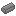
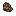
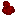
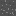
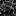
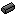

# ***minerals*** mod for [Minetest][]

## **Description**

An attempt to unify ores/gems/minerals from multiple different Minetest mods.

## **Minerals list**

- metals
  -  aluminum
  -  bronze
  -  chromite
  -  cobalt
  -  copper
  -  gold
  -  iron
  -  platinum
  -  silver
  -  tin
  -  titanium
- gems
  -  amethyst
  -  anhydrite
  -  anthracite
  -  aquamarine
  -  bismuth
  -  borax
  -  calcite
  -  cassiterite
  -  chert
  -  cinnabar
  -  cryolite
  -  diamond
  -  emerald
  -  garnet
  -  quartz
  -  ruby
  -  sapphire
  -  topaz
  -  uranium
- stone
  -  alabaster
  -  andesite
  -  basalt
  -  bauxite
  -  bedrock
  -  conglomerate
  -  dacite
  -  diorite
  -  marble
  -  marble_black
  -  marble_blue
  -  marble_red
  -  opal
- coal
  -  bituminous
  -  coal
- special
  -  adamantine
  -  adamantite
  -  geminitinum
  -  glowstone
  -  mese
  -  mithril
  -  osminum
  -  rainbow
  -  rarium
  -  unobtanium

## **Mods list**
* *default* ([minetest_game][])
* *[gems][gems_encrustable]* (Encrustable Gems) by wowiamdiamonds ([GitHub][gh.gems_encrustable])
* *[gems][gems_tools]* (Gem Tools) by LionLAD/captainLAD ([GitHub][gh.gems_tools])
* *[moreores][]* by Calinou ([GitHub][gh.moreores])
* *[ores][]* by Enke ([GitHub][gh.ores])
* *[oresplus][oresplus]* by everamzah ([GitHub][gh.oresplus])
  * **Note:** Forum post & GitHub repository created by separate users so may diverge
* *[quartz][]* by Evergreen ([GitHub][gh.quartz])
* *[rainbow_ore][]* by KingSmarty/FsxShader2012 ([GitHub][gh.rainbow_ore])
* *[uranium][]* by LandMine ([GitHub][gh.uranium])
* *[xtraores][]* by davidthecreator ([GitHub][gh.xtraores])

[Minetest]: http://www.minetest.net/

[gems_encrustable]: https://forum.minetest.net/viewtopic.php?t=2596
[gems_tools]: https://forum.minetest.net/viewtopic.php?t=4294
[minetest_game]: https://github.com/minetest/minetest_game
[moreores]: https://forum.minetest.net/viewtopic.php?t=549
[ores]: http://forum.freeminer.org/threads/ores-mod-wip-0-8-ores.98/
[oresplus]: https://forum.minetest.net/viewtopic.php?t=13120
[quartz]: https://forum.minetest.net/viewtopic.php?t=5682
[rainbow_ore]: https://forum.minetest.net/viewtopic.php?t=13519
[uranium]: https://forum.minetest.net/viewtopic.php?t=2234
[xtraores]: https://forum.minetest.net/viewtopic.php?t=12798

[gh.gems_encrustable]: https://github.com/wowiamdiamonds/gems
[gh.gems_tools]: https://github.com/captainLAD/gems
[gh.moreores]: https://github.com/minetest-mods/moreores
[gh.ores]: https://github.com/Nullsrc/Ores
[gh.oresplus]: https://github.com/taikedz/everamzah-oresplus
[gh.quartz]: https://github.com/minetest-mods/quartz
[gh.rainbow_ore]: https://github.com/FsxShader2012/rainbow_ore
[gh.uranium]: https://github.com/AntumMT/mtmod-uranium
[gh.xtraores]: https://github.com/AntumMT/mtmp-xtraores
