# ***minerals*** mod for [Minetest][]

## **Description**

An attempt to unify ores/gems/minerals from multiple different Minetest mods.

## **Minerals list**

-  adamantine - *ores*
-  adamantite - *xtraores*
-  agate - *geominer*
-  alabaster - *ores*
-  aluminum - *ores*
-  amethyst - *gems_tools*
- 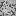 andesite - *ores*
- 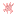 anhydrite - *ores*
-  anthracite - *xtraores*
-  aquamarine - *gems_encrustable*
-  basalt - *ores*
- 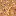 bauxite - *ores*
-  bedrock - *oresplus*
-  beryl - *geominer*
-  bismuth - *ores*
-  bituminous - *ores*
-  borax - *ores*
-  brass - *technic_worldgen*
-  bronze - *default*
-  calcite - *ores*
-  carbon steel - *technic_worldgen*
-  cassiterite - *ores*
-  cast iron - *technic_worldgen*
-  chert - *ores*
-  chromite - *ores*
-  chromium - *technic_worldgen*
-  cinnabar - *ores*
-  clay - *default*
-  coal - *default*
-  cobalt - *xtraores*
-  cobaltite - *ores*
- 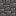 cobble - *default*
- 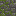 cobble (mossy) - *default*
-  conglomerate - *ores*
-  copper - *default*
-  cryolite - *ores*
- 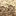 dacite - *ores*
- 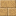 desert sand / sandstone - *default*
- 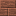 desert stone - *default*
-  diamond - *default*
-  diorite - *ores*
- 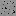 diorite - *geominer*
- 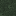 dungeon stone - *geominer*
-  emerald - *gems_tools*
-  emerald - *oresplus*
-  emerald - *geominer*
-  galvorn - *lottores*
-  garnet - *gems_encrustable*
-  geminitinum - *xtraores*
-  geodes - *lottores*
-  glowstone - *oresplus*
- 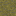 gneiss - *geominer*
-  gold - *default*
- 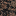 granite - *technic_worldgen*
- 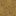 granite - *geominer*
- 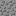 gravel - *default*
-  hematite - *geominer*
- 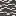 hornfels - *geominer*
-  iron - *default*
-  larimar - *geominer*
-  lead - *technic_worldgen*
-  lead - *lottores*
- 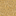 limestone - *geominer*
-  limestone - *lottores*
-  marble - *xtraores*
-  marble (black) - *xtraores*
-  marble (blue) - *xtraores*
- 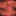 marble (red) - *xtraores*
-  marble - *geominer*
-  marble - *lottores*
- 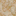 marble - *technic_worldgen*
-  mese - *default*
-  mithril - *moreores*
-  mithril - *lottores*
-  moonstone - *geominer*
-  obsidian - *default*
-  opal - *gems_encrustable*
-  osminum - *xtraores*
-  pearl - *lottores*
-  peridotite - *geominer*
-  platinum - *xtraores*
-  quartz - *quartz*
-  rainbow - *rainbow_ore*
-  rainbow - *xtraores*
-  rarium - *xtraores*
-  rough_rock - *lottores*
-  ruby - *gems_tools*
-  ruby - *geominer*
-  salt - *lottores*
- 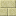 sand / sandstone - *default*
-  sapphire - *gems_tools*
-  sapphire - *geominer*
- 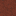 scoria - *geominer*
-  silver - *moreores*
-  silver - *lottores*
- 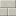 silver sand / sandstone - *default*
- 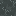 slate - *geominer*
-  stainless steel - *technic_worldgen*
-  steel - *default*
- 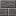 stone - *default*
-  sulfur - *technic_worldgen*
-  sunstone - *geominer*
-  tilkal - *lottores*
-  tin - *default*
-  tin - *lottores*
-  titanium - *xtraores*
-  topaz - *gems_encrustable*
-  unobtanium - *xtraores*
-  uranium - *uranium*
-  uranium - *technic_worldgen*
-  wrought iron - *technic_worldgen*
-  zinc - *technic_worldgen*

## **Mods list**

- *default* ([minetest_game][])
- *[gems][gems_encrustable]*  (Encrustable Gems) by wowiamdiamonds ([GitHub][gh.gems_encrustable])
- *[gems][gems_tools]*  (Gem Tools) by LionLAD/captainLAD ([GitHub][gh.gems_tools])
- *[geominer][]*  by Devy ([GitHub][gh.geominer])
- *[lottores][lott]*  by fishyWET ([GitHub][gh.lott])
- *[moreores][]*  by Calinou ([GitHub][gh.moreores])
- *[nether][]*  by PilzAdam ([GitHub][gh.nether])
- *[ores][]*  by Enke ([GitHub][gh.ores])
- *[oresplus][oresplus]*  by everamzah ([GitHub][gh.oresplus])
  - **Note:** Forum post & GitHub repository created by separate users so may diverge
- *[quartz][]*  by Evergreen ([GitHub][gh.quartz])
- *[rainbow_ore][]*  by KingSmarty/FsxShader2012 ([GitHub][gh.rainbow_ore])
- *[technic_worldgen][technic]*  by RealBadAngel ([GitHub][gh.technic])
- *[uranium][]*  by LandMine ([GitHub][gh.uranium])
- *[xtraores][]*  by davidthecreator ([GitHub][gh.xtraores])

## **Minerals/Metals to possibly add**

- acanthite
- alexandrite
- amber
- baryte
- biotite
- bornite
- chalcocite
- chalcopyrite
- celestine
- cerite
- cerussite
- diaboleite
- ephesite
- esperite
- fluorite
- hassium
- iridium
- kesterite
- nickel
- onyx
- osmium
- padparadscha
- pearl
- perite
- pyrite
- ruthenium
- spinel
- turquoise
- zircon

Wikipedia:
- [List of minerals](https://en.wikipedia.org/wiki/List_of_minerals)
- [List of gemstones](https://en.wikipedia.org/wiki/List_of_individual_gemstones)

[Minetest]: http://www.minetest.net/

[gems_encrustable]: https://forum.minetest.net/viewtopic.php?t=2596
[gems_tools]: https://forum.minetest.net/viewtopic.php?t=4294
[geominer]: https://forum.minetest.net/viewtopic.php?t=17771
[lott]: https://forum.minetest.net/viewtopic.php?t=5578
[minetest_game]: https://github.com/minetest/minetest_game
[moreores]: https://forum.minetest.net/viewtopic.php?t=549
[nether]: https://forum.minetest.net/viewtopic.php?t=5790
[ores]: http://forum.freeminer.org/threads/ores-mod-wip-0-8-ores.98/
[oresplus]: https://forum.minetest.net/viewtopic.php?t=13120
[quartz]: https://forum.minetest.net/viewtopic.php?t=5682
[rainbow_ore]: https://forum.minetest.net/viewtopic.php?t=13519
[technic]: https://forum.minetest.net/viewtopic.php?t=2538
[uranium]: https://forum.minetest.net/viewtopic.php?t=2234
[xtraores]: https://forum.minetest.net/viewtopic.php?t=12798

[gh.gems_encrustable]: https://github.com/wowiamdiamonds/gems
[gh.gems_tools]: https://github.com/captainLAD/gems
[gh.geominer]: https://github.com/CoderForTheBetter/geominer
[gh.lott]: https://github.com/minetest-LOTR/Lord-of-the-Test
[gh.moreores]: https://github.com/minetest-mods/moreores
[gh.nether]: https://github.com/PilzAdam/nether
[gh.ores]: https://github.com/Nullsrc/Ores
[gh.oresplus]: https://github.com/taikedz/everamzah-oresplus
[gh.quartz]: https://github.com/minetest-mods/quartz
[gh.rainbow_ore]: https://github.com/FsxShader2012/rainbow_ore
[gh.technic]: https://github.com/minetest-mods/technic
[gh.uranium]: https://github.com/AntumMT/mtmod-uranium
[gh.xtraores]: https://github.com/AntumMT/mtmp-xtraores
